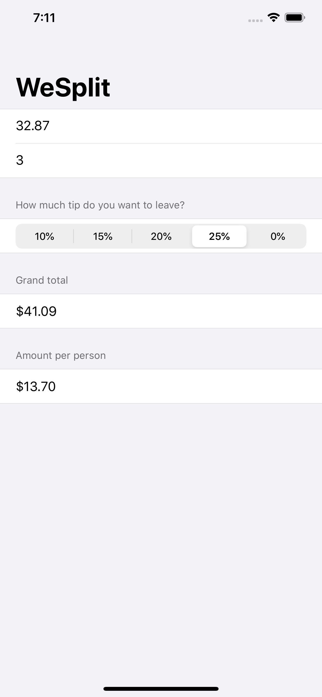

# WeSplit
This is the first project in the [100 Days of SwiftUI](https://www.hackingwithswift.com/100/swiftui) on [hackingwithswift.com](https://hackingwithswift.com).

WeSplit is a check-splitting app to help you determine how much each person in your party owes, when divided equally among you.
